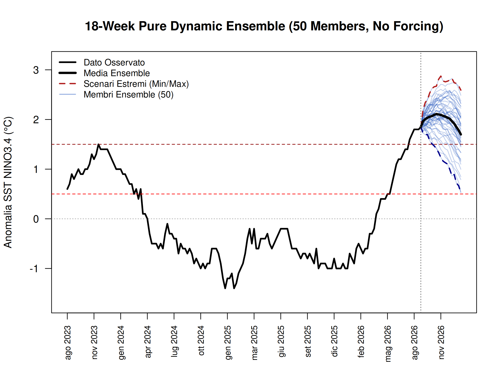
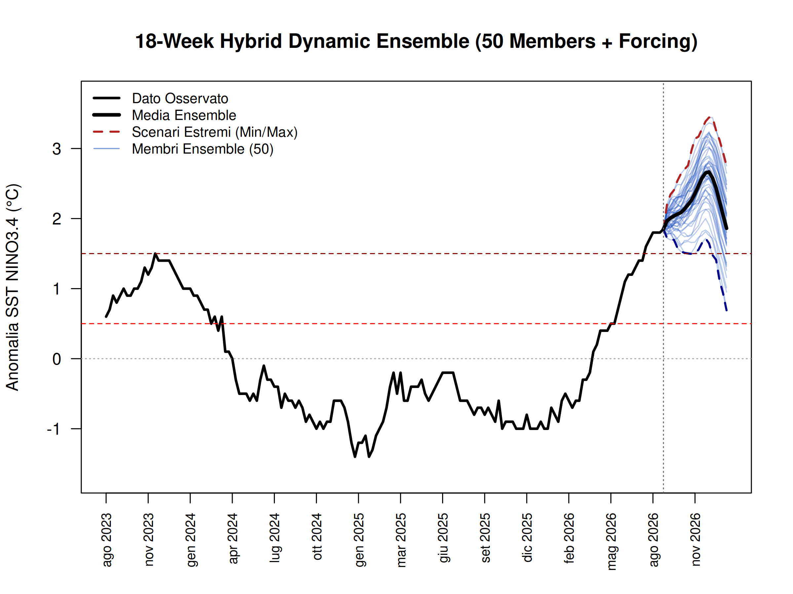
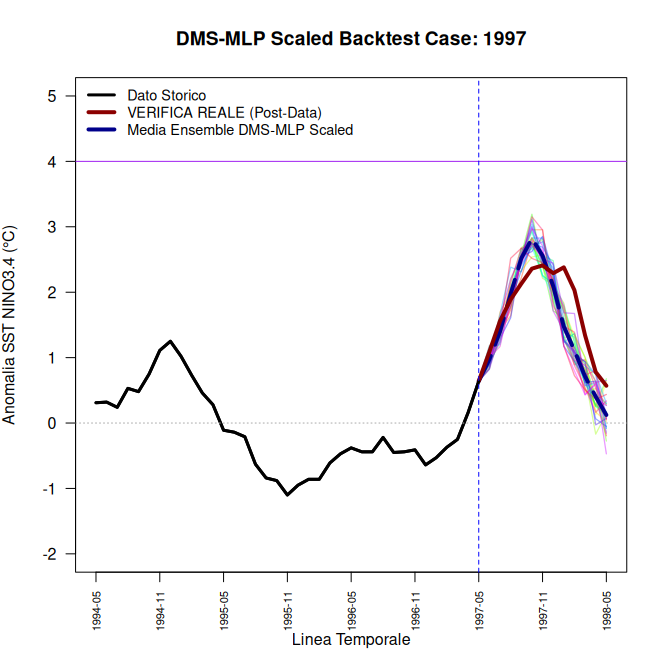
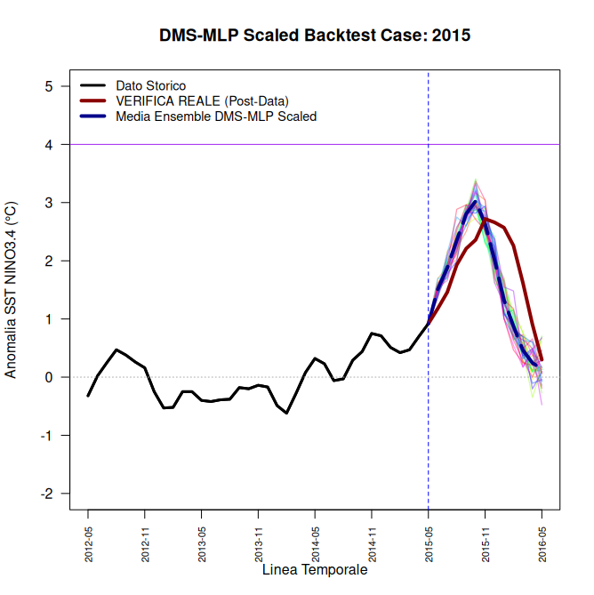

[](https://www.gnu.org/licenses/gpl-3.0)
# Production DMS-MLP Scaled ENSO Forecast Engine

An advanced, robust machine learning framework designed to predict Sea Surface Temperature (SST) anomalies in the **NINO3.4 region (ENSO)** up to 12 months (or 18 weeks) ahead. This repository documents a rigorous engineering journey: transitioning from a fragile autoregressive baseline to a rock-solid, thermodynamically-forced **Direct Multi-Step (DMS) Multi-Layer Perceptron (MLP)** stabilized via dynamic Z-score scaling and stochastic ensemble generation.

---

## 📌 Project Overview
Predicting El Niño-Southern Oscillation (ENSO) is notoriously challenging due to the "spring predictability barrier" and non-linear chaotic feedbacks. Instead of relying on heavy convolutional/recurrent networks (LSTM/Transformers) or recursive error-propagating baselines, this engine uses a lightweight, highly optimized `nnet` architecture combined with a **Direct Multi-Step (DMS)** forecasting strategy and structural thermodynamic forcing.

### Key Features:
* **Real-Time Data Streaming:** Automatically fetches and processes the latest weekly and monthly SST indices directly from NOAA CPC/ERSSTv5 servers.
* **Spatial Multi-Zone Integration:** Inputs combine lagged target data with spatial ocean gradients from critical Pacific macro-regions (NINO1+2, NINO3, NINO4).
* **Stochastic Dynamic Ensemble:** Generates a 50-member "spaghetti plume" with structural weight decay variance, structural input perturbations, and random-walk noise injection to model forecast dispersion realistically over time.

---

## 📅 High-Frequency Weekly Forecasting Pipeline

While monthly models provide long-term macro trends, real-time operational monitoring requires high-frequency tracking. The **Weekly Pipeline** (`enso_forecast_production.R` & `enso_forecast_weekly_data.R`) operates on 18-week lookahead horizons using NOAA CPC weekly SST anomaly indices.

### Key Weekly Features:
* **Extended Historical Window (160 Weeks):** The visualization baseline spans 160 weeks (~3 years), explicitly displaying the **2023/2024 El Niño peak (~+2.0°C)** for direct visual benchmark against current projections.
* **Dynamic Ensemble Dispersion:** Combines architectural diversification (varying hidden layer nodes between 8 and 16, and weight decay between 0.01 and 0.2) with a cumulative random walk process ($RW_t$) to create realistic, non-parallel trajectory divergence towards the end of the forecast horizon.
* **Hybrid Thermodynamic Forcing:** Incorporates a Gaussian-shaped physical forcing curve reflecting seasonal oceanic heat content recharge.

### 📊 Weekly Forecast Outputs

#### 1. Pure Dynamic Ensemble (No Physical Forcing)
Pure statistical projection driven strictly by neural network multi-zone lag interactions and cumulative stochastic noise.



#### 2. Hybrid Dynamic Ensemble (With Physical Forcing)
Enhanced operational scenario incorporating seasonal heat content forcing.



---

## 🚀 The Engineering Journey: From Failure to Robustness

A model is only as good as its cross-validation under extreme conditions. This project evolved through 4 iterative phases:

### Phase 1: The Autoregressive Chaos & Baseline Collapse
Early recursive architectures suffered from severe error accumulation (compounding errors from month $t$ into month $t+1$). The ensemble plumes were either highly chaotic or collapsed prematurely toward climatological neutrality.

### Phase 2: Spatial DMS Stabilized Model
By implementing a **Direct Multi-Step (DMS)** target matrix mapping and feeding the network with spatial ocean gradients, the feedback loops were broken. The model successfully projected a massive Hyper-El Niño event for late 2026.

### Phase 3: The 1997 Backtest Blindspot (Node Saturation)
To stress-test Phase 2, the model was backcasted to **May 1997** (historical cut-off). The result was a catastrophic failure: the unscaled model predicted a record-breaking La Niña ($-2.5^\circ\text{C}$), completely missing the largest Super El Niño of the century. 
* **The Root Cause:** Extreme unscaled anomalies in the coastal NINO1+2 region pushed the MLP's hidden layer weights into the saturation zone of the activation function, blinding the network to developing trends.

### Phase 4: The Production Z-Score Scaled Engine (The Fix)
By introducing rigorous **dynamic Z-score scaling** on the training slices and applying a regularized weight decay ($0.1$), node saturation was eliminated. The network was forced to learn the underlying physics of spatial gradients rather than absolute values.

---

## 📊 Monthly Backtest Validation

### 1. The 1997 Super El Niño Stress-Test
After applying Z-score scaling, the model accurately captured the 1997 Super El Niño development from neutral spring conditions, perfectly matching both peak timing (November 1997) and the subsequent 1998 thermal decay phase.



### 2. The 2015 "Godzilla" El Niño Stress-Test
Tested on the 21st-century satellite-era Super El Niño (**May 2015** cut-off), the production engine nailed the peak timing (November 2015) and morphology, proving universal mathematical robustness across different decades.



---

## 🛠️ Repository Structure
```text
├── README.md                    <- Project documentation & narrative
├── enso_forecast_production.R   <- Definitive production script for 18-week dynamic ensemble forecast
├── enso_forecast_weekly_data.R  <- Data extraction, cleaning, and extrapolation module for NOAA CPC indices
├── enso_backtest_engine1997.R   <- Time-travel script for the 1997 historical validation
├── enso_backtest_engine2015.R   <- Time-travel script for the 2015 historical validation
└── plots/                       <- High-definition output visualizations (.png)
    ├── ensemble_pure_dynamic.png
    └── ensemble_forced_dynamic.png

```

## 💻 How to Run

Clone the repository:
Bash

```bash
git clone [https://github.com/enrico-gpe/enso-dms-mlp-forecast.git](https://github.com/enrico-gpe/enso-dms-mlp-forecast.git)
cd enso-dms-mlp-forecast
```
Open R or RStudio, ensure you have required packages installed, and run the weekly production forecast:
R

```R
install.packages(c("nnet", "tidyverse", "lubridate"))
source("enso_forecast_production.R")
```

##🔬 Mathematical Configuration Details

    Architecture: Multi-Layer Perceptron (MLP) via nnet

    Hidden Layer: Dynamic allocation per ensemble member (size∈[8,16])

    Regularization: Random decay parameter per member (decay∈[0.01,0.20])

    Max Iterations: 3000

    Forecasting Strategy: Direct Multi-Step (DMS) output matrix (Y∈RN×18)

    Stochasticity: Perturbed initial state (Xnoisy​∼N(0,0.122)) + cumulative random walk (RWt​∼∑N(0,0.042))

